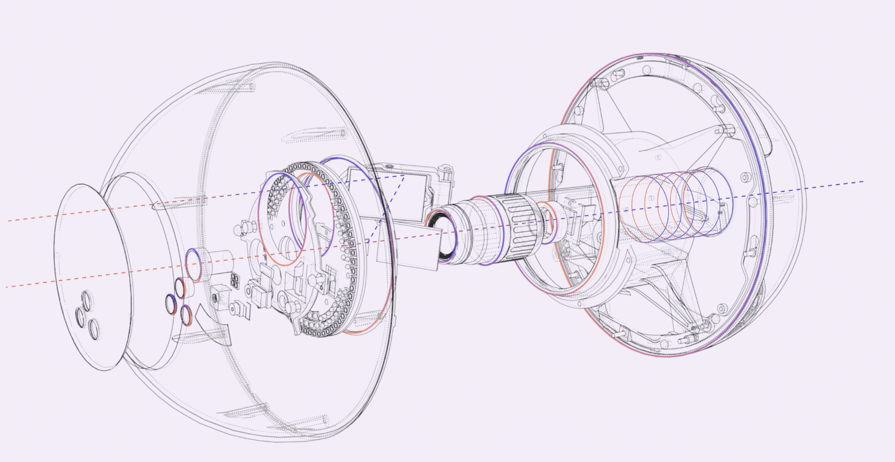

hokomsanho@gmail.com

# Worldcoin Hardware
pnpm i @worldcoin/minikit-js
คำสั่งหลากหลายลายเซ็น
Summary Submissions

ลายเซ็น
/signature

คำสั่งลายเซ็น
/recaptcha

Bot.run
As we work towards decentralization, we are incrementally open sourcing the Orb. The goal is to provide transparency and, eventually, the ability to verify our claims. Ultimately, we plan to decentralize everything involving the Orb, enabling others to develop, manufacture, and operate similar devices to issue Proof-of-Personhood credentials in a privacy-preserving manner. 

We're excited to share the engineering files of the Orb with you! For more details on how it works in detail check out [our blogpost](https://worldcoin.org/blog/engineering/opening-orb-look-inside-worldcoin-biometric-imaging-device).

If you see any issues with the design, we encourage you to create an issue to help improve future versions. 

## High-level Goals

The goal of the hardware team at Tools for Humanity is to provide products that on a high level meet the following requirements:

* Validate humanness & create a unique code to verify uniqueness in a privacy-preserving manner, as seamlessly as possible
* Ready for mobile and outdoor use (think camera equipment)
* Continuous mobile use throughout the day without significant downtime
* Enable detection of internal attacks (physical manipulation of the device) and external fraud attempts (presentation attacks) by using additional sensors that are not needed for the calculation of the unique code
* Unique visual appearance

## Hardware Products

Our initial hardware product release consists of: 

* The Orb: our core imaging device
* A custom exchangeable battery for the Orb

We will expand the scope of this repository as new products mature. We expect privacy-preserving Proof-of-Personhood to become a lasting primitive for the internet.

## Directory Structure

    ├── Orb
    │   ├── Electronics
    │   ├── Mechanics
    |   └── BOM
    |
    ├── Battery
    |   ├── Electronics
    │   ├── Mechanics
    |   └── BOM

## What's not included

### Tamper detection system not disclosed 

For obvious reasons, these files do not include the PCBs and sensors related to the Orb's tamper detection system. 

### Components pending licenses for disclosure

When designing our product, we have utilized certain proprietary information (IP) that we have not yet received confirmation from the vendor to share, or that cannot be shared as part of our open-source efforts. This includes CAD models of certain electronic boards and IP related to the electrical interface between the Jetson and the heat camera. As a result, we are currently unable to publish the bridge board that connects the main board and the front unit.

## License

Copyright 2020-2023 The Worldcoin Foundation.

You may use this package under the Worldcoin Responsible Use License, version 1.0, or at your option, any later version. See the file [COPYING](COPYING.md) for more details, and [LICENSE](LICENSE.md) for the terms of the Worldcoin Responsible Use License, version 1.0.

The Worldcoin Responsible Use License seeks a balance between fostering transparency and decentralization while preventing capture (inspired by Uniswaps [BSL](https://uniswapfoundation.mirror.xyz/lr8hUW5FFYWmvsm9ZmO6bLdLAaAx5EAnFEbJG_OTd8g) and Electric Coin Co.’s [BOSL](https://electriccoin.co/blog/introducing-tgppl-a-radically-new-type-of-open-source-license/)) and reducing the risk that Worldcoin technology could be used in harmful ways. Under the license, within about two years of publication the Worldcoin Foundation will - consistent with its governance protocols and practices at the time - review and decide whether to remove the use restrictions specified in Section II.1 of the license. Further, no more than two years after that review date, those restrictions will be lifted. As this is an unfamiliar license you may have questions or feedback. Any proposals for improvements, objections or alternative approaches are welcome. 
