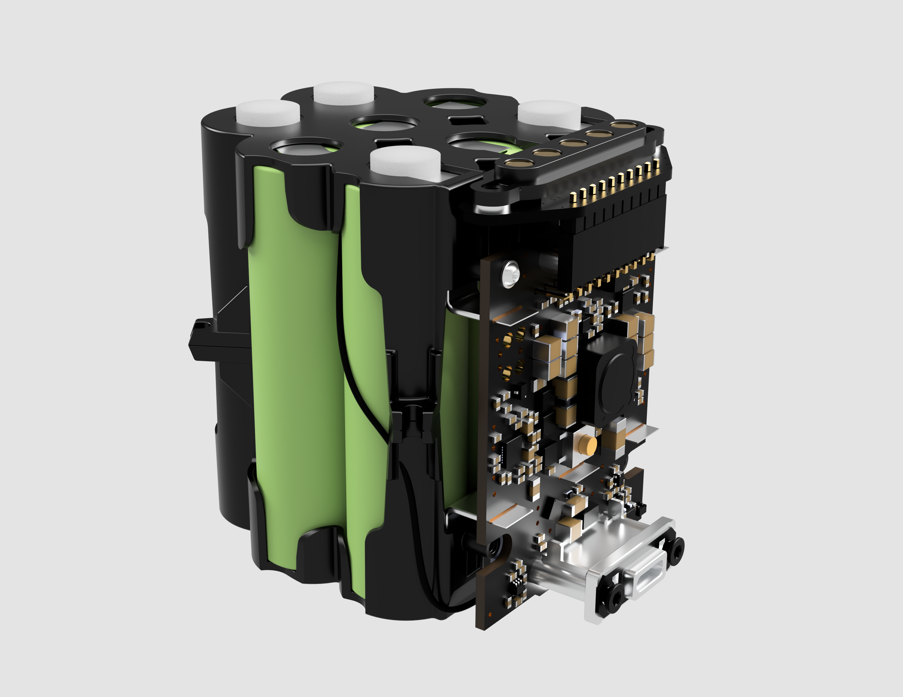

## Overview
Our exchangeable battery is responsible for powering the orb during the dayli operations. Key facts: 
* **Cell**: 8x 18650 Li-Ion cells 
* **Configuration**: 4SP2 (4 in series, 2 strings parallel)
* **Nominal voltage**: 14.8V
* **Capacity**: 96.48Wh
* **Charging interface**: USB-C
* **Other**: UN38.3 certified

## Mechanics

You can download the .stp-files [here](mechanics/download.sh).

Preview STP-File:

    

## Electronics

Preview battery circuit board:

    

## Bill of material structure
Part of our release is a drilled-down bill of material listing all the parts used in our device. 

The columns in that file are: 
* **Level**: Due to multiple assemblies in our device, we have a nested BOM. The level column tells you how deep this component is nested.
* **Item number**: Running number within the Assembly / Sub-Assembly
* **Partnumber**: Our internal part-number
* **Manufacturer P/N**: The part-number / unique name that our supplier uses as a part reference
* **Quantity**: Quantity of the part in the given assembly context

Please note that some parts have multiple entries in our BOM as each line lists the component in a different assembly context. 

## Directory Structure

    ├── Electronics         # Board and schematics
    ├── Mechanics           # STP-Files
    └── BOM                 # Bill of material   

## License

Copyright 2020-2023 The Worldcoin Foundation.

You may use this package under the Worldcoin Responsible Use License, version 1.0, or at your option, any later version. See the file [COPYING](../COPYING.md) for more details, and [LICENSE](../LICENSE.md) for the terms of the Worldcoin Responsible Use License, version 1.0.
