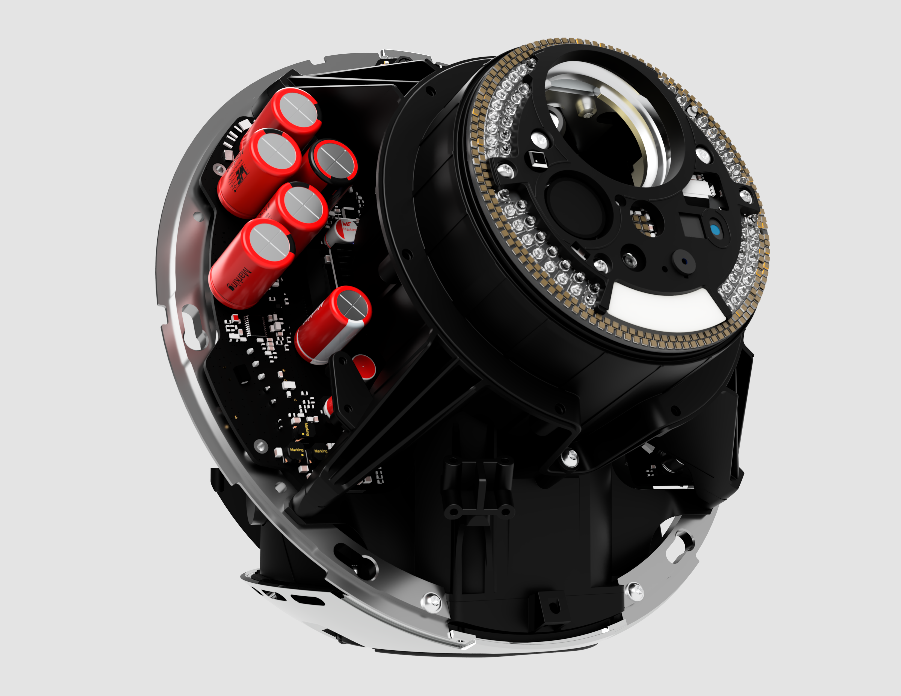
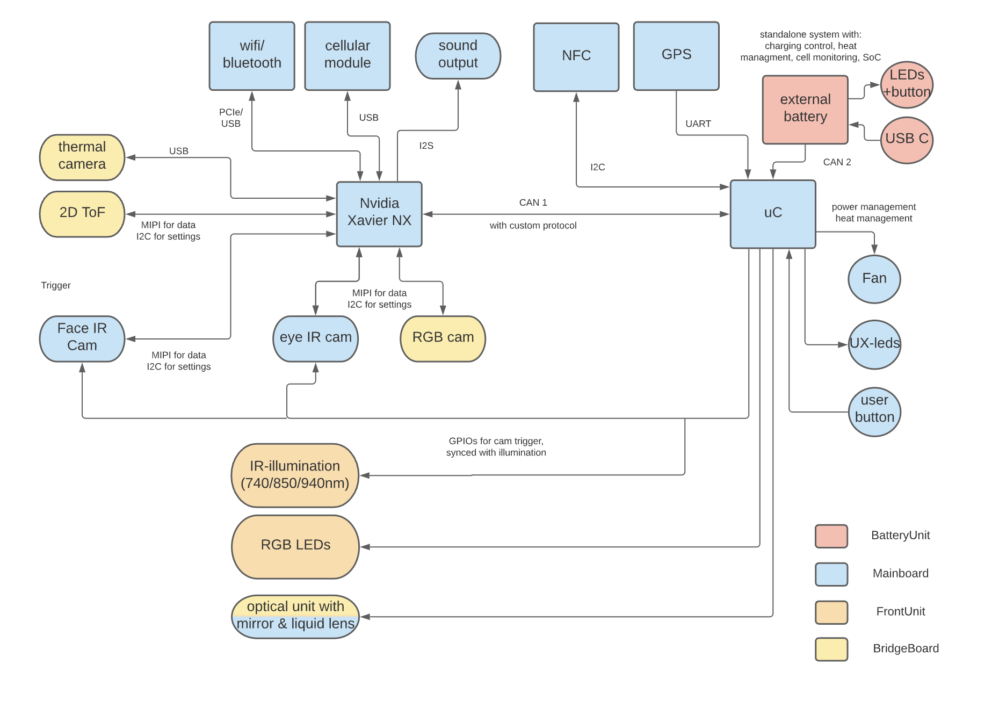
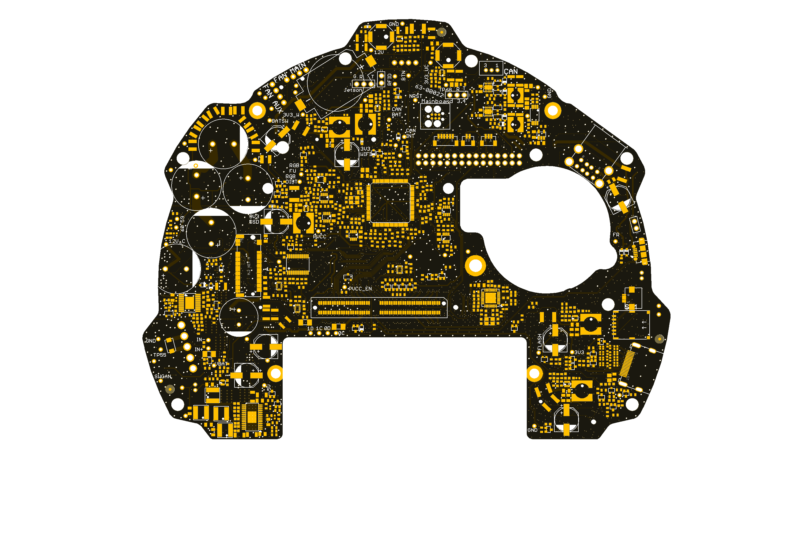
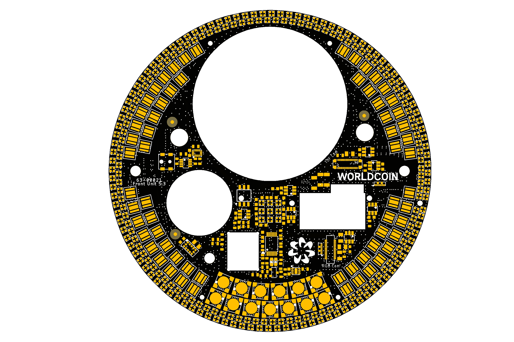

## Overview
The orb consists of five modules that group our used components: 
* **Optics**: Passive optical parts (e.g., mirrors and lenses)
* **Cooling**: Passive cooling components (e.g., heat pipes)
* **Chassis**: Parts that form the internal structure
* **Outer shell**: Parts associated with the outer shell
* **Electronics**: PCBAs and other active electronic modules

If you look at our engineering data, you might find a difference between the renders of our device and the actual design. The reason is that the first design that we've put into manufacturing optimizes for precisely that. Ensure a fast time to market with an MVP and work on the final design after you have something that is manufacturable. 

## Required Tools
**Electronics**: The first release will only be EAGLE files. Later releases might be Altium. There are free viewers available for both. 

**Mechanics**: As we're releasing STP-Files, most standard CAD software should be able to open our models. If there are issues, please let us know.

## Mechanics

You can download the .stp-files [here](mechanics/download.sh).

Preview STP-File:

    

## Electronics
Block diagram electronics: 

    

Preview Mainboard:

    

Preview Frontunit:

    

## Bill of material structure
Part of our release is a drilled-down bill of material listing all the parts used in our device. 

The columns in that file are: 
* **Level**: Due to multiple assemblies in our device, we have a nested BOM. The level column tells you how deep this component is nested. E.g. *TLA, PEARL ORB, EVT* is the top-level assembly and because of that level 0, the *Gimbal Inner Axis* is for example level 4 (*TLA, PEARL ORB, EVT* -> *Optics Module* -> *OCS Front Frame* -> *Gimbal Unit*)
* **Item number**: Running number within the Assembly / Sub-Assembly
* **Partnumber**: Our internal part-number
* **Manufacturer P/N**: The part-number / unique name that our supplier uses as a part reference
* **Quantity**: Quantity of the part in the given assembly context

Please note that some parts have multiple entries in our BOM as each line lists the component in a different assembly context. 

## Directory Structure

    ├── Electronics         # Board and schematics
    ├── Mechanics           # STP-Files
    └── BOM                 # Bill of material   

## License

Copyright 2020-2023 The Worldcoin Foundation.

You may use this package under the Worldcoin Responsible Use License, version 1.0, or at your option, any later version. See the file [COPYING](../COPYING.md) for more details, and [LICENSE](../LICENSE.md) for the terms of the Worldcoin Responsible Use License, version 1.0.
